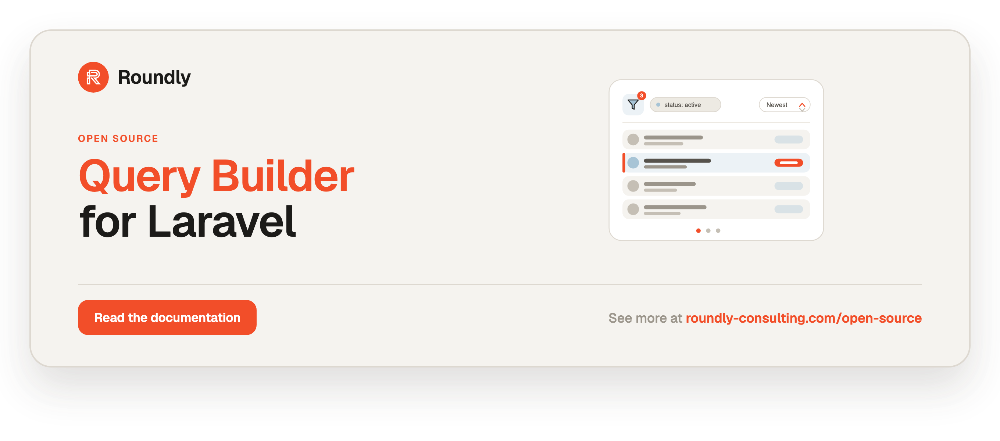

<!-- roundly-hero:start -->
<p align="center">
  <a href="https://roundly-consulting.com/open-source/docs/query-builder-for-laravel?utm_source=github&utm_medium=readme&utm_campaign=open-source&utm_content=query-builder-for-laravel">
    
  </a>
</p>
<!-- roundly-hero:end -->

<!-- roundly-badges:start -->
<p align="center">
  <a href="https://packagist.org/packages/roundly-consulting/query-builder-for-laravel"></a>
  <a href="https://github.com/roundly-consulting/query-builder-for-laravel/actions/workflows/run-tests.yml"></a>
  <a href="https://github.com/roundly-consulting/query-builder-for-laravel/actions/workflows/fix-php-code-style-issues.yml"></a>
  <a href="https://donate.stripe.com/dRmeVe8FX5PF1Qd9pXcEw00"></a>
  <a href="https://www.patreon.com/cw/roundly"></a>
  <a href="https://roundly-consulting.com/support-us?utm_source=github&utm_medium=readme&utm_campaign=open-source&utm_content=query-builder-for-laravel#crypto"></a>
</p>
<!-- roundly-badges:end -->

# Query Builder for Laravel

Allow-list-driven filtering, sorting and pagination for Laravel API list endpoints. Read the
request query string (`filter[...]`, `sort=`, `page`, `per_page`) and apply **only** the
filters and sorts a controller explicitly permits — everything else is rejected. It is built
natively on Laravel: no runtime dependencies beyond Laravel, Symfony, and our own companion
packages.

## Requirements

- PHP `^8.4`
- Laravel `^12.0` or `^13.0`
- [`roundly-consulting/enums-for-laravel`](https://github.com/roundly-consulting/enums-for-laravel)
  and [`roundly-consulting/package-toolkit-for-laravel`](https://github.com/roundly-consulting/package-toolkit-for-laravel)
  (installed automatically as dependencies)

## Installation

```bash
composer require roundly-consulting/query-builder-for-laravel
```

The package ships **no** migrations or models — it only reads the request and mutates a query
builder the host application owns. Optionally publish the config file:

```bash
php artisan vendor:publish --tag="query-builder-config"
```

The error messages are translatable; publish them to override the wording:

```bash
php artisan vendor:publish --tag="query-builder-translations"
```

`php artisan about --only=query-builder` prints the wire contract the package is
currently serving (parameter names, page-size bounds, unknown-parameter modes, limits).

## Configuration

The published `config/query-builder.php`:

```php
return [
    'parameters' => [
        'filter' => 'filter',   // filter[<name>]=<value>
        'sort'   => 'sort',     // sort=-created_at,name
    ],

    'pagination' => [
        'page_name'        => 'page',
        'per_page_name'    => 'per_page',
        'default_per_page' => 20,
        'max_per_page'     => 100,
    ],

    'mode' => [
        'unknown_filter' => 'reject',
        'unknown_sort'   => 'reject',
    ],

    'limits' => [
        'max_filter_values' => 50,   // most comma/array items per filter value
        'max_value_length'  => 255,  // most characters per individual value
        'max_sorts'         => 5,    // most allow-listed sort columns applied
    ],
];
```

| Key | Type | Default | Purpose |
|---|---|---|---|
| `parameters.filter` | string | `filter` | Query-string key that holds the filter bag. |
| `parameters.sort` | string | `sort` | Query-string key that holds the sort string. |
| `pagination.page_name` | string | `page` | Paginator page parameter name — applied automatically when you `paginate()`/`simplePaginate()` a `QueryBuilder`, and readable from a `HasPageSize` request via `pageName()`. |
| `pagination.per_page_name` | string | `per_page` | Page-size parameter name (used by `HasPageSize`). |
| `pagination.default_per_page` | int | `20` | Page size used when `per_page` is absent or invalid. At least `1` and at most `max_per_page`. |
| `pagination.max_per_page` | int | `100` | Upper bound — `per_page` above it is a 422; also a hard cap. At least `1`. |
| `mode.unknown_filter` | string | `reject` | `reject` (HTTP 400) or `ignore` (drop the key) for un-allow-listed filters. |
| `mode.unknown_sort` | string | `reject` | `reject` (HTTP 400) or `ignore` (drop the key) for un-allow-listed sorts. When `ignore` drops every requested sort, `defaultSort()` applies. |
| `limits.max_filter_values` | int | `50` | Comma/array items kept per filter value; extras are dropped (DoS guard). |
| `limits.max_value_length` | int | `255` | Characters kept per individual filter value; longer values are truncated. |
| `limits.max_sorts` | int | `5` | Sort columns applied, after duplicates are removed keeping the first. Only allow-listed sorts count, so a token dropped in `ignore` mode never takes a valid one's place. |

The package works with zero host configuration — the shipped defaults are the intended wire
contract.

Every key is read strictly: a key that is not set — absent, `null` or blank (a host's `KEY=`) —
takes its default, and any other invalid value throws package-toolkit's
`InvalidConfigurationException` naming the key. The parameter names must be strings, the limits and page sizes whole numbers of at least `1`, and the
modes exactly `reject` or `ignore` — a typo'd mode throws rather than quietly falling back to
`reject`, and a junk limit is no longer cast and clamped to `1`.

## Usage

Build a query for a model (or a prepared builder), declare the allow-list, then treat the
result like any Eloquent builder — unknown calls forward straight through:

```php
use RoundlyConsulting\QueryBuilder\AllowedFilter;
use RoundlyConsulting\QueryBuilder\AllowedSort;
use RoundlyConsulting\QueryBuilder\QueryBuilder;

$posts = QueryBuilder::for(Post::class)
    ->allowedFilters(
        AllowedFilter::exact('status'),
        AllowedFilter::partial('title'),
        AllowedFilter::scope('published', booleans: true),
        AllowedFilter::callback('min_views', fn ($query, $value) => $query->where('views', '>=', $value)),
        AllowedFilter::trashed(),
    )
    ->allowedSorts('title', AllowedSort::field('popularity', 'views'))
    ->defaultSort('-created_at')
    ->with(['author'])
    ->paginate($request->perPage());
```

`QueryBuilder::for()` accepts either a model class string or a prepared builder (so you can
pre-scope with `Post::query()->where(...)`). A second, optional argument overrides the request
it reads from (defaults to the current `request()`).

**Declare `allowedFilters()`, `allowedSorts()` and `defaultSort()` before any builder call.**
The request is applied the first time a call is forwarded to the builder (`where()`, `with()`,
`get()`, …), because the forwarded call may be the one that runs the query. A declaration after
that point throws `AllowListAlreadyApplied` (a `LogicException`) instead of being silently
ignored:

```php
QueryBuilder::for(Post::class)
    ->allowedFilters('status')      // declare first…
    ->where('views', '>', 0)        // …then any builder call
    ->get();

QueryBuilder::for(Post::class)
    ->where('views', '>', 0)
    ->allowedFilters('status');     // throws AllowListAlreadyApplied
```

Constraints you want in place before the request is applied belong on the builder you pass in:
`QueryBuilder::for(Post::query()->where('views', '>', 0))`.

### Filters

| Constructor | Request | Effect |
|---|---|---|
| `AllowedFilter::exact('status')` | `filter[status]=published` | `where('status', 'published')`; a comma list becomes `whereIn`. |
| `AllowedFilter::boolean('active')` | `filter[active]=true` | Exact match on a **boolean** column: `true`/`false`/`1`/`0` (any case) compared as real booleans; any other value matches nothing. |
| `AllowedFilter::partial('title')` | `filter[title]=hello` | `LIKE` contains (`%hello%`) — `ILIKE` on Postgres — with `%`/`_` escaped via an explicit `ESCAPE '\'` clause on sqlite/mysql/pgsql. Case-insensitive as far as the engine folds case (see below). |
| `AllowedFilter::beginsWith('code')` | `filter[code]=SKU` | Anchored prefix `LIKE` (`SKU%`), escaped, same case folding as `partial`. |
| `AllowedFilter::endsWith('code')` | `filter[code]=-01` | Anchored suffix `LIKE` (`%-01`), escaped, same case folding as `partial`. |
| `AllowedFilter::operator('min_views', FilterOperator::GreaterThanOrEqual, 'views')` | `filter[min_views]=10` | Fixed comparison `where('views', '>=', 10)`; a comma list becomes a grouped `OR`. |
| `AllowedFilter::operators('status', [RequestedOperator::Not])` | `filter[status]=not:draft` | The **client** picks the comparison, from the set declared here. A bare value still means equality. |
| `AllowedFilter::nullable('project', 'project_id', FilterValueShape::Uuid)` | `filter[project]=none` | Exact match on a **nullable** column, with `none` for "unset" and `not:none` for "is set". A negation also matches the unset rows. |
| `AllowedFilter::relation('label', 'labels', 'labels.id')` | `filter[label]=not:<id>` | Matches through a **relation** — `whereHas`, and `whereDoesntHave` for a negation. |
| `AllowedFilter::scope('published', booleans: true)` | `filter[published]=false` | Calls the model scope `scopePublished(...)`; the value is passed as **one** argument (`booleans: true` makes `true`/`false`/`1`/`0` real booleans). |
| `AllowedFilter::scope('between', spread: true)` | `filter[between]=10,100` | Calls the scope with the array **spread** across its arguments (opt-in — see below). |
| `AllowedFilter::callback('min_views', $cb)` | `filter[min_views]=10` | Invokes `$cb($query, $value, $name)`; takes `booleans: true` like `scope()`. |
| `AllowedFilter::trashed()` | `filter[trashed]=with` | `with` includes trashed, `only` returns only trashed (honouring a custom soft-delete column), otherwise non-trashed (needs `SoftDeletes`). |
| `AllowedFilter::custom('x', $filter)` | `filter[x]=…` | Runs your own `Filter` implementation; takes `booleans: true` like `scope()`. |

Every constructor takes an optional internal name to map a public request key to a different
column or scope: `AllowedFilter::exact('state', 'status')`.

**Case folding is the engine's.** `partial()`, `beginsWith()`, `endsWith()` and the `contains` /
`ncontains` / `starts` operators ignore letter case the way the database does, and the three
engines differ outside plain ASCII:

| Engine | Operator | Case folding |
|---|---|---|
| PostgreSQL | `ILIKE` | Follows the database's ctype locale: Unicode under a UTF-8 locale (`ärger` finds `Ärger`), ASCII only under `C`. Accents still count. |
| MySQL / MariaDB | `LIKE` | Follows the column's collation: the default `_ci` collations fold Unicode case **and** accents (`arger` finds `Ärger`); a `_bin` / `_cs` collation is case-sensitive. |
| SQLite | `LIKE` | ASCII letters only: `hello` finds `HELLO`, but `ärger` does **not** find `Ärger`. |

`operator()` picks the comparison **server-side** from the `FilterOperator` enum (`=`, `!=`,
`>`, `>=`, `<`, `<=`) — the wire stays `filter[<name>]=<value>`; the operator is never read
from the request. Use it instead of a hand-written comparison `callback`:

```php
use RoundlyConsulting\QueryBuilder\Enums\FilterOperator;

->allowedFilters(
    AllowedFilter::operator('min_level', FilterOperator::GreaterThanOrEqual, 'level'),
)
```

`operators()` is the one constructor where a **request influences which comparison runs** — and
it is still an allow-list decision made in code. The request supplies a *token*, not an operator:

```php
use RoundlyConsulting\QueryBuilder\Enums\RequestedOperator;

->allowedFilters(
    AllowedFilter::operators('status', [RequestedOperator::Not]),
    AllowedFilter::operators('title', [RequestedOperator::Contains], partialByDefault: true),
)
```

Tokens: `is` · `not` · `contains` · `ncontains` · `starts` · `gt` · `gte` · `lt` · `lte`. A token
that is unknown, or that this filter did not declare, is **not an operator** — the whole string
becomes the value, so `filter[status]=1=1 or 1:draft` filters for that literal text and matches
nothing. The filter's own default (`is`, or `contains` under `partialByDefault`) is always
nameable, so a client can switch back; nothing else is implicit. Only a known token before the
**first** colon counts, so `filter[url]=https://example.test` still filters for itself.

The operator is per **filter**, not per value: `not:draft,archived` means "neither" (`whereNotIn`,
not a grouped OR of negations, which would match nearly every row). Both negations also include
rows where the column is `NULL`, because "not draft" plainly includes "no status at all".

**A nullable column needs `nullable()`, not `operators()`.** The two things a person most wants
from such a column cannot be said in a bare value — "the rows with no project" and "the rows that
have one" — so it takes a sentinel (`none` by default, renameable) and reads its negation:

```php
use RoundlyConsulting\QueryBuilder\Enums\FilterValueShape;

->allowedFilters(
    AllowedFilter::nullable('project', 'project_id', FilterValueShape::Uuid),  // none · not:none · not:<id>
    AllowedFilter::relation('label', 'labels', 'labels.id', FilterValueShape::Uuid),
)
```

`relation()` is the constructor for a to-many match, and its negation is `whereDoesntHave` —
never a negated `whereHas`, which keeps exactly the rows it should exclude (a row related to two
labels still satisfies the subquery through the other one).

**Declare a `FilterValueShape` on any typed column.** Postgres answers a value of the wrong type
with an error rather than "no match", so `filter[project]=garbage` on a uuid column is a
request-triggerable 500. With a shape declared, a value the column cannot hold is answered with an
empty result (and a *negation* of one excludes nothing, since no row could have matched it). It is
accepted by `operators()`, `nullable()` and `relation()`; the default `Text` guards nothing, so no
existing filter changes. The shapes are `Text`, `Uuid`, `Id` (a non-negative integer that fits a
bigint) and `Boolean` (`true`/`false`/`1`/`0` in any case, handed to the query as real booleans):

```php
->allowedFilters(
    AllowedFilter::operators('active', [RequestedOperator::Not], shape: FilterValueShape::Boolean), // not:true
)
```

Values are normalised once before a filter runs: a comma list becomes an array and one level of
`filter[x][]=` array nesting is flattened. **`true` and `false` stay text** — a title search for
"false" is a search — unless the filter says its value is a boolean: `AllowedFilter::boolean()`,
a `FilterValueShape::Boolean`, or `booleans: true` on `scope()` / `callback()` / `custom()`, which
turns each `true`/`false`/`1`/`0` (any case) into a real boolean and leaves every other value as it
was. Without it a scope receives the string, and PHP reads `'false'` as truthy:

```php
// Post::scopePublished(Builder $query, bool $published)
->allowedFilters(
    AllowedFilter::boolean('active'),                        // filter[active]=false
    AllowedFilter::scope('published', booleans: true),       // filter[published]=false → false
)
```

To keep a request from turning into an expensive query, filter values are also bounded by the
`limits.*` config — excess comma/array items and over-long values are dropped/truncated, and
duplicate sort columns are removed.

**Scope spreading is opt-in.** By default a scope filter passes the (normalised) value as a
**single** argument — `filter[published]=a,b` calls `scopePublished($query, ['a', 'b'])`. This
stops the request from controlling how many arguments a scope receives, which could otherwise
inject an optional column/operator parameter of a scope with a signature like
`scopeSearch($q, $term, $column = 'title')`. Enable spreading only for a scope you own whose
arguments map to a comma/array value:

```php
// Post::scopeViewsBetween(Builder $query, int $min, int $max)
->allowedFilters(
    AllowedFilter::scope('views_between', spread: true), // filter[views_between]=10,100
)
```

### Sorts

```php
->allowedSorts('title', AllowedSort::field('popularity', 'views'), AllowedSort::custom('length', new TitleLengthSort))
->defaultSort('-created_at')          // applied only when no `sort` param is present
```

- `sort=title` sorts ascending; a leading `-` (`sort=-title`) sorts descending.
- `sort=-created_at,name` applies multiple sorts left to right, at most `limits.max_sorts` of
  them.
- `defaultSort()` supports the same `-` prefix and comma multi-sort, and runs only when the
  request names no sort — or, in `ignore` mode, none the allow-list knows. A default-sort column
  outside the allow-list is sorted by that column directly.

A bare string is sugar: a string filter becomes `exact`, a string sort becomes `field`.

### Pagination — `HasPageSize`

Mix `HasPageSize` into a FormRequest to validate and resolve the page size:

```php
use Illuminate\Foundation\Http\FormRequest;
use RoundlyConsulting\QueryBuilder\Concerns\HasPageSize;

final class ListPostsRequest extends FormRequest
{
    use HasPageSize;

    public function rules(): array
    {
        return [
            ...$this->pageSizeRules(),
            // your other rules
        ];
    }
}
```

```php
$posts = QueryBuilder::for(Post::class)
    ->allowedFilters('status')
    ->paginate($request->perPage());
```

`per_page` above `max_per_page`, below 1, or non-integer yields a **422**; `perPage()` also
hard-caps at `max_per_page` and falls back to `default_per_page` as defence in depth.

`paginate()` / `simplePaginate()` on a `QueryBuilder` are handed the configured
`pagination.page_name` automatically, so renaming the page parameter in config is honoured
on the wire (`?p=2`) and in the generated links. Pass `pageName:` yourself to override it,
or read it from the request (`$request->pageName()`) when you build a paginator by hand.

### Frozen wire contract

| Concern | Syntax | Semantics |
|---|---|---|
| Filter | `filter[<name>]=<value>` | One param per filter; `<name>` is the allow-list key. |
| Multi-value filter | `filter[<name>]=a,b,c` | Comma-split → array; `exact` → `whereIn`. |
| Boolean filter value | `filter[<name>]=true` / `false` | A real bool (also `1`/`0`, any case) only for a filter that opts in — `boolean()`, `FilterValueShape::Boolean`, `booleans: true`. Every other filter receives the text. |
| Sort asc / desc | `sort=field` / `sort=-field` | Leading `-` = descending. |
| Multi-sort | `sort=-created_at,name` | Comma list, applied left → right; duplicate columns collapse to the first, capped by `limits.max_sorts` (allow-listed sorts only). |
| Pagination | `page=<n>` & `per_page=<n>` | Laravel paginator names; `per_page` validated by `HasPageSize`. |
| Unknown filter/sort key | any key not allow-listed | HTTP 400 (or dropped in `ignore` mode; with every sort dropped, the default sort applies). |
| Invalid `per_page` | `> max`, `< 1`, non-integer | HTTP 422. |

### Unknown parameters

Requesting a filter or sort that is not allow-listed throws `UnknownFilter` / `UnknownSort`,
both `Symfony` HTTP exceptions with a **400** status and a translatable message
(`query-builder::errors.*`). The reflected key names are capped (first few, each truncated,
with an "…and N more" suffix) so attacker-controlled keys can't flood the response or logs.
Set `mode.unknown_filter` or `mode.unknown_sort` to `ignore` to silently drop the offending
key and apply only the allow-listed ones instead. A sort string that is dropped entirely reads
as if it were absent, so `defaultSort()` still orders the page.

Every exception the package throws implements `RoundlyConsulting\QueryBuilder\Exceptions\QueryBuilderException`.
Besides the two 400s, two are developer mistakes (`LogicException`s, never request-triggered):
`UnsupportedOperator` for a filter declared with an operator it cannot perform, and
`AllowListAlreadyApplied` for an allow-list declared after the request was applied.

### Custom filters and sorts

Implement the contracts to plug in bespoke logic:

```php
use Illuminate\Database\Eloquent\Builder;
use RoundlyConsulting\QueryBuilder\Contracts\Filter;

final class EvenViewsFilter implements Filter
{
    public function apply(Builder $query, mixed $value, string $property): void
    {
        $query->whereRaw('views % 2 = 0');
    }
}

// ...->allowedFilters(AllowedFilter::custom('even', new EvenViewsFilter))
```

```php
use Illuminate\Database\Eloquent\Builder;
use RoundlyConsulting\QueryBuilder\Contracts\Sort;
use RoundlyConsulting\QueryBuilder\Enums\SortDirection;

final class TitleLengthSort implements Sort
{
    public function apply(Builder $query, SortDirection $direction, string $property): void
    {
        $query->orderByRaw('LENGTH(title) '.$direction->value);
    }
}

// ...->allowedSorts(AllowedSort::custom('length', new TitleLengthSort))
```

## Testing

```bash
composer test
```

## Changelog

See [CHANGELOG.md](CHANGELOG.md).

<!-- roundly-support:start -->
## Support our work

This package is free and open source, built and maintained by
[Roundly Consulting](https://roundly-consulting.com/open-source?utm_source=github&utm_medium=readme&utm_campaign=open-source&utm_content=query-builder-for-laravel).
If it saves you time, please consider supporting our open-source work — a one-time donation, a
monthly pledge on Patreon or a crypto donation helps fund maintenance, new features and new
packages.

<a href="https://donate.stripe.com/dRmeVe8FX5PF1Qd9pXcEw00"></a>
<a href="https://www.patreon.com/cw/roundly"></a>
<a href="https://roundly-consulting.com/support-us?utm_source=github&utm_medium=readme&utm_campaign=open-source&utm_content=query-builder-for-laravel#crypto"></a>
<!-- roundly-support:end -->

## License

The MIT License (MIT). Please see [LICENSE.md](LICENSE.md). Maintained by roundly-consulting.
